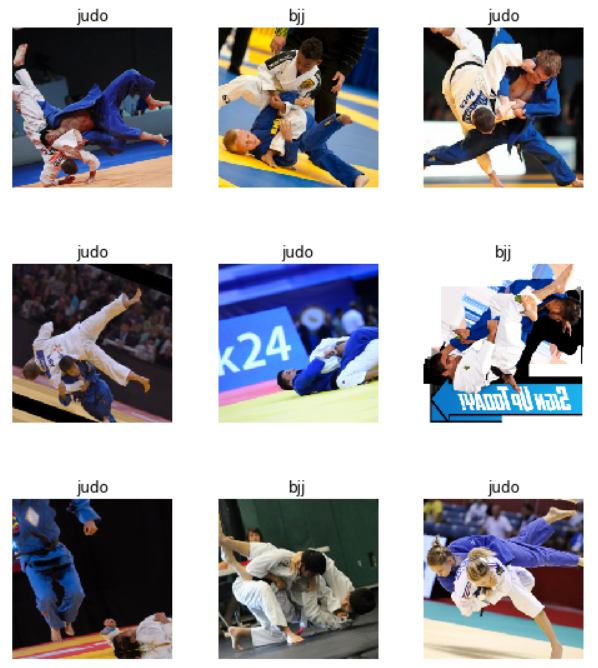

# bjj_judo
Brazilian Jiu-Jitsu or Judo? Image classification for the grappling arts.
Please see bjj_judo.ipynb for the notebook. 

Deep learning advances in recent years mean that state of the art results in formerly complex image classification tasks, such as the ability to discern between a cat and a dog, or different pet breeds, beyond 99% accuracy is achievable with minimal training and preprocessing. 

This notebook explores making ones own dataset from Google Images, and seeing how a relatively small dataset can yield worthwhile results by standing on the shoulders of pre-trained models -- resnet in this case. 

Training an algorithm to recognize the difference between Brazilian Jiu-Jitsu and Judo seemed an interesting challenge since they look so similar; practitioners of both sports wear the traditional 'gi', usually white or blue, and photos generally exhibit two combatants grappling. 

The difference I hope to algorithms pick up upon is based on the two arts' approach. In very general terms and of course plenty of exceptions, Brazilian jiu-jitsu takes place on the ground, with each practitioner trying to physically outwit the other to achieve a position where the opponent submits. 

In Judo, points can be scored by throwing the opponent from a standing position, as well as by pinning their body to the ground. Again, this is a very general hypothesis and there will certainly be many exceptions, however, I hope the model will learn that pixels showing standing practioners attempting a throwm may reveal themselves to be Judo, whereas tighter grappling on the ground may more often than not be Jiu-Jitsu. 
